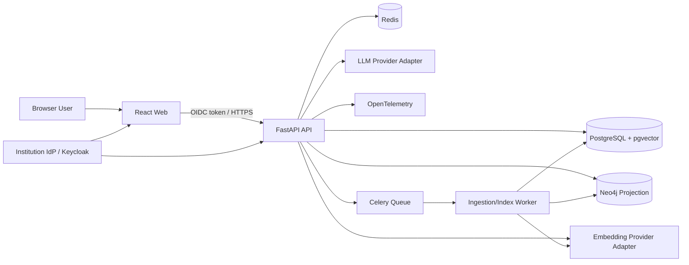

# System Architecture

상태: Baseline

## Context

시스템은 인증된 기관 사용자에게 규정 검색, QA, ontology 탐색을 제공하고, Curator에게 ingestion/review/publication 기능을 제공한다. 외부 경계는 기관 IdP와 선택된 LLM/embedding provider다.

## 논리 아키텍처



## 컴포넌트 책임

| 컴포넌트 | 책임 | 소유하지 않는 것 |
|---|---|---|
| React Web | 사용자 흐름, 상태 표현, graph interaction | 업무 규칙, ACL 판단 |
| FastAPI API | 인증/인가, use case orchestration, REST/SSE, audit | 장시간 ingestion 실행 |
| Worker | parse, extraction, embedding, projection, eval | public HTTP 응답 |
| PostgreSQL | canonical data, pgvector, publication, audit | graph traversal 최적화 |
| Neo4j | 승인된 ontology projection과 bounded traversal | 정본, 사용자/권한 |
| Redis | queue broker, 짧은 TTL cache, rate limit | 영구 지식/감사 데이터 |
| Provider adapters | LLM/embedding 호출과 정책 적용 | domain 결정, 권한 판단 |

## Backend 모듈

```text
backend/app/
├─ api/              routers, auth dependencies, DTO mapping
├─ application/      use cases, ports, transaction orchestration
├─ domain/           entities, value objects, policies, errors
├─ infrastructure/
│  ├─ postgres/      SQLAlchemy repositories, pgvector queries
│  ├─ neo4j/         projection and query templates
│  ├─ providers/     LLM/embedding adapters
│  ├─ queue/         Celery tasks
│  └─ observability/
└─ settings/         typed configuration
```

의존 방향은 `api → application → domain`; infrastructure가 application port를 구현한다.

## 주요 데이터 흐름

### Ingestion/Publication

1. API가 원본 metadata와 object reference/checksum을 PostgreSQL에 `UPLOADED`로 등록한다.
2. Worker가 안전하게 파일을 읽고 구조를 파싱해 version/provision/chunk staging 데이터를 쓴다.
3. 규칙 + LLM adapter가 ontology proposal을 만들고 provenance를 기록한다.
4. Curator가 proposal을 승인한다.
5. Worker가 embedding과 Neo4j staging projection을 생성하고 validation한다.
6. publication transaction이 active snapshot ID를 바꾸고 watermark를 기록한다.
7. 실패 시 기존 active publication은 유지된다.

### QA

1. API가 token claim과 application scope를 확인한다.
2. 질문, 기준일, scope를 정규화하고 query record를 만든다.
3. lexical/vector/graph lane을 ACL/as-of predicate와 함께 실행한다.
4. candidate를 결합/rerank/context pack한다.
5. LLM이 structured answer/citation proposal을 생성한다.
6. citation verifier가 claim-source support, version, ACL을 확인한다.
7. 통과하면 응답/trace/audit을 저장하고 SSE 또는 JSON으로 반환한다. 실패하면 1회 제한 재생성 후 보류한다.

### Ontology Viewer

1. API가 검색 seed를 PostgreSQL/Neo4j에서 찾는다.
2. 승인된 query template으로 제한된 subgraph를 조회한다.
3. 각 node/edge의 source security class를 현재 scope와 대조한다.
4. UI-friendly nodes/edges, pagination/expansion token, watermark를 반환한다.

## 정본과 일관성

- PostgreSQL publication ID가 정본이다.
- Neo4j의 `projection_watermark`가 active publication과 같을 때 `healthy`다.
- 다르면 graph lane을 비활성화하거나 이전 snapshot을 명확히 표시한다.
- vector row도 `publication_id`, `embedding_version`을 가져 혼합 index를 방지한다.
- projection은 idempotent upsert 후 count/checksum validation으로 교체한다.

## Degraded modes

| 장애 | 동작 |
|---|---|
| Neo4j 불가 | graph lane 제외, vector+lexical만으로 기준 충족 시 `degraded` 표시; 아니면 보류 |
| Embedding provider 불가 | 기존 query embedding cache가 없으면 lexical/graph로 제한; 품질 gate 미달 시 보류 |
| LLM provider 불가 | 검색 결과와 원문 link만 제공하거나 `system_unavailable` 보류 |
| Redis 불가 | 새 background job 접수 중단, read API는 직접 DB 경로 유지 |
| PostgreSQL 불가 | fail closed; 지식/권한/감사 정본 없이는 서비스하지 않음 |

## 배포 단위

- `web`: static asset + reverse proxy/CDN
- `api`: stateless replicas
- `worker`: ingestion/eval queue별 autoscaling 가능
- `postgres`: managed 또는 institution-managed HA
- `neo4j`: single dev, production HA profile 검토
- `redis`: broker/cache 분리 가능
- `observability`: collector + metrics/log backend

## 확장 경계

- OCR, 외부 법령 connector, OpenSearch Korean analyzer는 별도 adapters로 추가한다.
- provider/model 변경은 domain/API contract를 변경하지 않는다.
- tenant 격리가 필요해지면 tenant ID와 RLS를 도입하되 첫 MVP는 단일 기관 deployment를 기준으로 한다.

