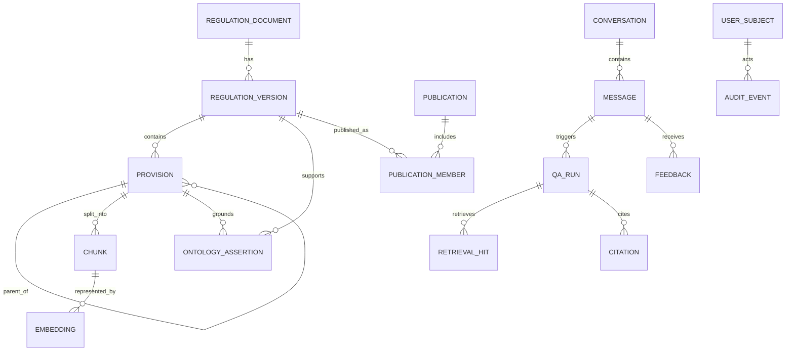

# Data Model

상태: Baseline

## 저장 원칙

- PostgreSQL이 canonical store다.
- UUIDv7 또는 time-sortable UUID를 application ID로 사용한다.
- 시각은 UTC `timestamptz`, 업무 효력일은 `date`로 저장한다.
- 모든 mutable row에 `created_at`, `updated_at`; 중요 객체에 `created_by`, `revision`을 둔다.
- 원문 version은 immutable이며 수정은 새 version으로 만든다.
- soft delete를 남용하지 않고 명시적 lifecycle status를 사용한다.

## 주요 ER model

## Core tables

### `regulation_document`

| Column | Type | Constraint/의미 |
|---|---|---|
| `id` | uuid | PK |
| `document_code` | text | unique, 기관 내 stable code |
| `title` | text | not null |
| `document_type` | text | controlled vocabulary |
| `owner_org_id` | uuid | organization FK |
| `security_class` | enum | `PUBLIC/INTERNAL/RESTRICTED` |
| `status` | enum | `ACTIVE/ARCHIVED` |
| `is_mock` | boolean | not null |

### `regulation_version`

| Column | Type | Constraint/의미 |
|---|---|---|
| `id` | uuid | PK |
| `document_id` | uuid | FK |
| `version_label` | text | document 내 unique |
| `promulgated_on` | date | nullable |
| `effective_from` | date | not null |
| `effective_to` | date | nullable, exclusive end 권장 |
| `status` | enum | lifecycle 상태 |
| `source_object_uri` | text | access-controlled object reference |
| `source_sha256` | char(64) | immutable checksum |
| `mime_type` | text | allowlist |
| `parser_version` | text | provenance |
| `supersedes_version_id` | uuid | self FK nullable |

Constraint: published version의 `[effective_from, effective_to)`가 같은 document에서 겹치지 않도록 exclusion constraint를 사용한다.

### `provision`

| Column | Type | 설명 |
|---|---|---|
| `id` | uuid | PK |
| `version_id` | uuid | FK |
| `parent_id` | uuid | self FK |
| `level` | enum | PART/CHAPTER/SECTION/ARTICLE/PARAGRAPH/ITEM/SUBITEM |
| `ordinal` | integer | sibling order |
| `canonical_path` | text | version 내 unique, 예 `art-5/p-2/i-1` |
| `locator` | text | 사용자 표시, 예 `제5조 제2항 제1호` |
| `title` | text | nullable |
| `body` | text | 원문 |
| `body_sha256` | char(64) | 무결성 |
| `source_span` | jsonb | page/offset/line 정보 |

### `chunk`

| Column | Type | 설명 |
|---|---|---|
| `id` | uuid | PK |
| `provision_id` | uuid | FK |
| `chunk_index` | integer | provision 내 순서 |
| `text` | text | 검색 본문 |
| `context_prefix` | text | 문서/장/조 제목 문맥 |
| `token_count` | integer | 생성 tokenizer 기준 |
| `chunker_version` | text | provenance |
| `publication_id` | uuid | 활성 snapshot |
| `security_class` | enum | source에서 상속 |

### `embedding`

| Column | Type | 설명 |
|---|---|---|
| `id` | uuid | PK |
| `chunk_id` | uuid | FK |
| `model_id` | text | provider-qualified model ID |
| `dimensions` | integer | vector dimension |
| `vector` | vector(N) | 구현 시 dimension migration 확정 |
| `content_sha256` | char(64) | 재사용/무효화 key |
| `embedding_version` | text | config bundle |
| `created_at` | timestamptz | 생성 시각 |

unique `(chunk_id, embedding_version)`. 초기 index는 cosine HNSW, recall 검증용 exact query path를 별도로 둔다.

## Ontology staging/canonical tables

### `ontology_entity`

`id`, `entity_type`, `canonical_key`, `label`, `properties jsonb`, `security_class`, `ontology_version`, `publication_id`.

### `ontology_assertion`

node 또는 edge 제안을 한 table에서 provenance 중심으로 관리한다.

| Column | 설명 |
|---|---|
| `id`, `assertion_type` | `NODE/EDGE` |
| `subject_entity_id`, `predicate`, `object_entity_id` | triple |
| `source_provision_id` | 필수 근거 |
| `properties jsonb` | condition/threshold 등 |
| `method`, `extractor_version`, `confidence` | 자동 추출 이력 |
| `review_status`, `reviewed_by`, `reviewed_at` | human review |
| `publication_id` | snapshot |

edge unique key는 publication + subject + predicate + object + source provision을 기준으로 한다.

### `graph_projection`

`id`, `publication_id`, `ontology_version`, `status`, `started_at`, `completed_at`, `node_count`, `edge_count`, `checksum`, `neo4j_watermark`, `error_summary`.

## Publication

### `publication`

| Column | 설명 |
|---|---|
| `id` | snapshot ID |
| `status` | `BUILDING/VALIDATING/ACTIVE/FAILED/RETIRED` |
| `ontology_version`, `embedding_version` | bundle |
| `activated_at`, `activated_by` | activation audit |
| `manifest_sha256` | member/checksum manifest |

### `publication_member`

`publication_id`, `version_id`, `source_sha256`, `security_class`. Active publication은 institution profile당 하나다.

Canonical table에는 retired publication의 row가 함께 남을 수 있다. 따라서 snapshot hydration,
lexical/vector/graph candidate 생성은 반드시 선택된 `ACTIVE` publication의
`publication_member`와 결합하고, chunk/ontology의 `publication_id`도 같은 값인지 확인한다.
전역 document/version/provision table만 조회해 snapshot을 구성하지 않는다.

## Identity/Authorization

- `user_subject`: IdP `issuer + subject`, display metadata 최소 저장
- `role_binding`: subject/group → application role
- `document_scope`: subject/group/role → document/security/owner scope
- `organization`: 조직 hierarchy와 stable code

PostgreSQL RLS는 defense-in-depth로 검토하되 application authorization을 대체하지 않는다.

## QA/Audit

### `conversation` / `message`

대화 제목과 user/assistant message를 분리한다. 질문 본문 retention/redaction 정책을 적용하고 assistant message는 structured answer JSON과 표시 text를 저장한다.

### `qa_run`

- `id`, `owner_subject`, `request_id`, `message_id`, `as_of`, `scope_hash`
- 질문 원문 대신 기본적으로 `question_sha256`를 저장한다.
- `publication_id`, `graph_watermark`
- `generation_model_id`, `embedding_version`, `prompt_version`, `retriever_version`
- `status`, answer, warnings, suggested actions, `abstention_reason`, lane별 latency/token/cost metadata
- `trace_summary jsonb`; raw chain-of-thought 저장 금지

QA API 인스턴스의 process memory는 정본이 아니다. QA 결과와 소유권은 같은 transaction으로
PostgreSQL에 기록하며, 다른 API 인스턴스나 재시작 후에도 query ID로 조회할 수 있어야 한다.

### `retrieval_hit`

`qa_run_id`, `lane`, `rank`, `chunk/provision/entity ID`, original score, fused score, selected flag. 민감 text 복제 대신 source ID를 저장한다.

### `citation`

`qa_run_id`, `claim_index`, `source_id`, `document_id`, `version_id`, `provision_id`,
`quote_start/end`, `quote_sha256`, verifier result. 원문 quote를 중복 저장하지 않고 immutable
canonical provision에서 재구성하며 hash가 달라지면 fail closed 한다.

### `audit_event`

append-only: `id`, `occurred_at`, `actor_subject`, `action`, `target_type/id`, `request_id`, `outcome`, `metadata jsonb`, `prev_hash`, `event_hash`. DB role로 update/delete를 금지하고 partition/retention은 승인된 절차로만 수행한다.

## Indexes

- regulation: `(document_code)`, effective date GiST/range, title trigram GIN
- provision: `(version_id, canonical_path)`, locator/title trigram, body full/trigram index
- embedding: HNSW per active embedding profile + B-tree `publication_id/security_class`
- ontology: canonical key, predicate, source provision, publication
- audit: time partition + actor/action/target/request indexes
- QA: request/message/publication/status/time

## Deletion/Retention

- published 원문/version은 보존 정책 내 immutable
- embedding/graph projection은 원문에서 재생성 가능하며 profile 폐기 시 삭제 가능
- 대화/질문은 기관 정책에 따라 본문 redaction 또는 삭제하고 audit에는 비식별 event만 유지
- legal hold는 retention job보다 우선한다.
