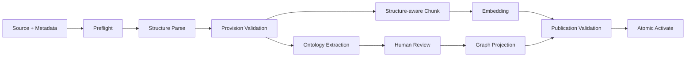
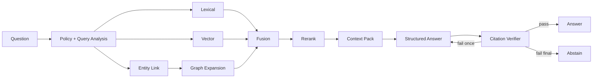

# GraphRAG and Knowledge Pipeline

상태: Baseline

## 품질 계약

GraphRAG의 목표는 “무조건 답하기”가 아니라 다음 조건을 만족하는 답변만 내보내는 것이다.

1. 사용자에게 허용된 문서에서만 검색한다.
2. 질문 기준일에 유효한 버전만 사용한다.
3. 답변 주장은 citation으로 지지된다.
4. 충돌/부족/장애를 숨기지 않는다.
5. 실행을 snapshot과 config로 재현할 수 있다.

## Offline knowledge build



### 1. Preflight

- allowlisted MIME/size, malware scan, checksum duplicate
- required metadata와 날짜/버전 범위 검증
- source object는 immutable key로 저장

### 2. Structure parse

- heading/list/문서 패턴으로 편/장/절/조/항/호/목을 생성
- source page/offset/line span 보존
- numbering gap, duplicate locator, orphan paragraph를 blocker/warning으로 구분
- parser는 원문을 교정하지 않는다.

### 3. Chunking

- 기본 단위는 Article 또는 Paragraph이며 짧은 항/호는 부모 문맥과 묶는다.
- 긴 provision은 semantic-safe window로 나누되 overlap과 parent locator를 보존한다.
- `context_prefix = 문서명 > 장 > 조 제목 > locator`
- 예외/단서 문장은 가능하면 대상 norm과 같은 context pack에 들어가도록 relation hint를 만든다.
- chunk content hash가 같으면 embedding을 재사용할 수 있다.

### 4. Ontology extraction

1. deterministic rule로 조문/상호참조/정의/수치 조건 후보 생성
2. LLM structured output으로 Norm, Actor, Action, Object, Condition, Exception, Control 제안
3. schema validation과 canonical entity linking
4. source span, confidence, extractor/prompt/model version 저장
5. 사람 검토 후 승인

LLM이 만든 node/edge는 source locator가 없으면 저장하지 않는다.

### 5. Embedding/Projection

- 승인된 publication 후보의 chunk만 embedding
- embedding profile별 차원을 섞지 않는다.
- Neo4j projection은 stable IDs와 `publication_id`로 idempotent upsert
- node/edge count, dangling edge, source coverage, manifest checksum 검증
- 동일 publication 교체의 node/edge/watermark 변경은 하나의 명시적 Neo4j write transaction으로 실행

### 6. Publication gate

- parser blocker 0
- 모든 chunk에 valid provision/source checksum
- approved ontology assertion source coverage 100%
- embedding coverage 100%(제외 사유 승인 항목 제외)
- graph dangling edge 0
- smoke Golden QA와 ACL/as-of tests 통과
- 활성화는 single transaction/compare-and-swap

## Online QA pipeline



### Query analysis

출력 schema:

- normalized question
- intent: definition, obligation, prohibition, exception, responsibility, procedure, comparison, temporal, unknown
- `as_of`, explicit document/department scope
- candidate entities/terms
- answer shape와 ambiguity flag

Query rewriting은 원 질문을 대체하지 않고 추가 검색 query만 만든다.

### ACL/time filter

모든 lane에 동일한 compiled policy를 전달한다.

- allowed document IDs/security class/owner scope
- publication ID
- `effective_from <= as_of < effective_to`(종료 null 허용)
- review/publish status

후처리로 민감 결과를 제거하는 방식만 사용하면 rank/count side channel이 생기므로 금지한다.

### Retrieval lanes

#### Lexical

- document title/code, locator, exact defined term 우선
- body trigram/term similarity
- 조문 번호가 질문에 있으면 locator boost

#### Vector

- question embedding과 chunk cosine similarity
- HNSW 후보 수를 충분히 확보한 뒤 metadata filter 결과 부족 시 iterative/exact fallback 검토
- ANN recall을 정기적으로 exact baseline과 비교

#### Graph

- entity link confidence threshold 적용
- 허용 relation template만 사용
- 기본 1–2 hop, 최대 node/edge/time budget
- Exception, Cross-reference, Implemented-by 경로에 의도별 boost
- graph 결과는 항상 source provision으로 역매핑
- PostgreSQL 정본에서 principal document/security, active version, source locator, APPROVED
  provenance를 먼저 컴파일하고 그 allowlist만 고정 Cypher template의 parameter로 전달
- Neo4j row는 canonical edge ID·방향·predicate·locator와 다시 일치시킨 뒤 사용하며, projection
  watermark 불일치 또는 장애 시 graph score를 제외하고 lexical/vector 결과만 재평가
- Mock profile은 같은 정책 컴파일러를 거친 deterministic in-memory graph를 사용

### Fusion/Rerank

- 초기: lane별 rank를 RRF로 결합해 score scale 차이를 완화
- exact locator/defined term match는 deterministic boost
- 동일 provision/chunk deduplicate, source diversity 확보
- top 30을 rerank, 최종 context 8–12 source를 초기값으로 eval 조정
- lane 원점과 score를 trace에 보존

### Context packing

- 질문과 직접 관련 조문, 부모 제목/정의, 연결 예외/상호참조를 묶는다.
- citation ID는 server가 할당하며 모델이 임의 source를 만들 수 없다.
- 서로 다른 version이 섞이지 않게 document/as-of consistency를 확인한다.
- context token budget 초과 시 중복/낮은 rank부터 제거하고 핵심 예외는 유지한다.
- retrieved text 안의 prompt-like 문장은 데이터로 구분하는 delimiter를 사용한다.

### Structured generation

모델 출력 예시 schema:

```json
{
  "status": "answered",
  "claims": [
    {"text": "...", "citation_ids": ["src-1"], "qualification": null}
  ],
  "summary": "...",
  "warnings": [],
  "follow_up_questions": []
}
```

- context citation ID allowlist 밖 참조는 schema validation 실패
- 숫자/기간/빈도/주체/예외 claim은 citation 필수
- 법적 최종 판단 표현을 피하고 규정상 확인 가능한 범위로 제한

### Citation verification

1. citation ID/ACL/version/as-of 무결성
2. quote가 source text의 실제 span인지 확인
3. deterministic check: 숫자, 날짜, negation, actor, modality 일치
4. claim-source semantic support grader
5. coverage: 중요한 claim이 모두 citation을 가짐

실패 시 문제 claim과 허용 source를 넣어 1회 재생성한다. 다시 실패하면 해당 claim 제거 또는 전체 abstention이다.

## Abstention policy

| Reason | 조건 | 사용자 안내 |
|---|---|---|
| `insufficient_evidence` | threshold/coverage 미달 | 찾은 범위와 질문 구체화 안내 |
| `access_limited` | 현재 scope에서 답변 불가 | 제한 문서 존재를 암시하지 않음 |
| `ambiguous_question` | 해석에 따라 답이 달라짐 | 필요한 업무/시점/대상 질문 |
| `conflicting_sources` | 동일 시점 근거 충돌 | 양쪽 근거와 담당자 확인 권고 |
| `system_unavailable` | 필수 lane/provider 장애 | 재시도/원문 검색 링크 |

고정 similarity score 하나만으로 answerability를 결정하지 않고 retrieval coverage, intent-required fields, citation verifier를 결합한다.

## Evaluation

### Offline metrics

- Retrieval: Recall@5/10, MRR, nDCG, lane ablation
- Entity linking: precision/recall/F1
- Graph path: expected entity/relation/provision coverage
- Answer: grounded rubric, completeness, contradiction
- Citation: precision, completeness, locator accuracy
- Abstention: precision/recall, false-answer rate
- Temporal/ACL: violation count(목표 0)
- Performance: lane/generation/verifier latency와 token/cost

### Dataset slices

- direct, paraphrase, multi-hop, exception, comparison, temporal
- unanswerable, ambiguous, conflicting
- Restricted allowed/denied
- Korean spacing/abbreviation/오타
- graph outage/vector outage degraded mode

### Release rule

보안/시간 위반은 1건이라도 blocker다. 품질 metric은 `PROJECT_CHARTER.md` 목표를 충족하고 baseline 대비 중요 slice 회귀가 없어야 한다.

## Version bundle

각 QA run에 다음을 기록한다.

`publication_id + source manifest + ontology_version + parser_version + chunker_version + embedding_profile + retriever_version + reranker_version + prompt_version + generation_model/config + verifier_version`
